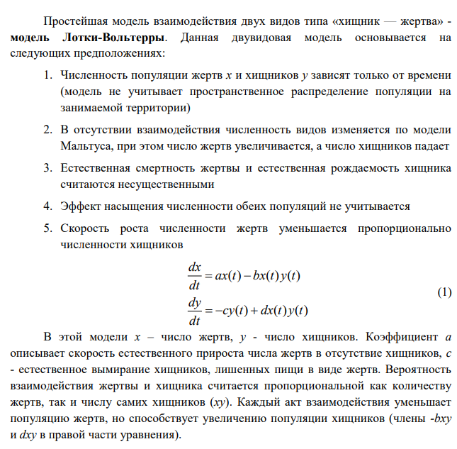
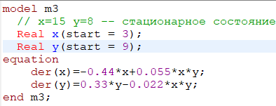
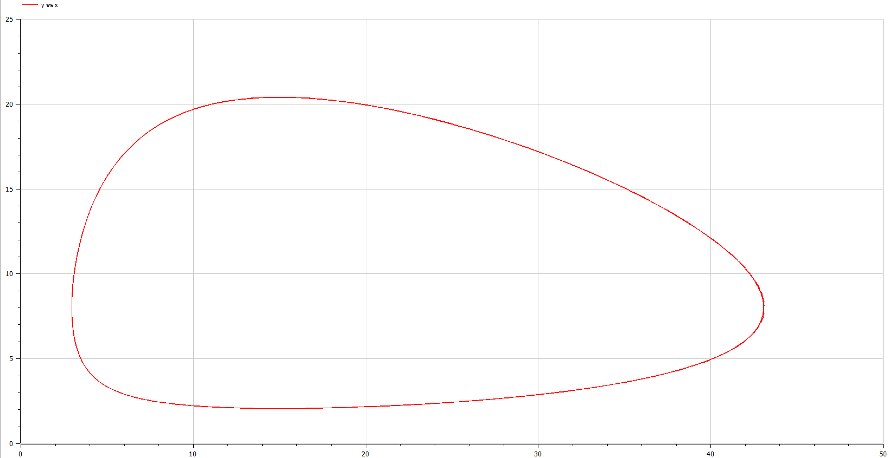
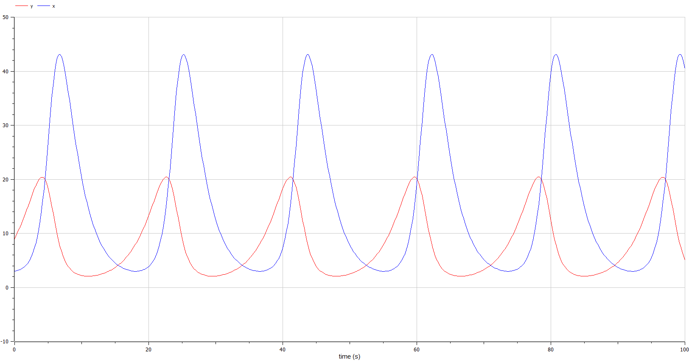

---
## Front matter
lang: ru-RU
title: Lab5 Модель хищник-жертва 
author: Поздняков Данила Романович
institute: RUDN University, Moscow, Russian Federation
date: 2022, 25 February

## Formatting
toc: false
slide_level: 2
theme: metropolis
header-includes: 
 - \metroset{progressbar=frametitle,sectionpage=progressbar,numbering=fraction}
 - \makeatletter
 - \beamer@ignorenonframefalse
 - \makeatother
 - \usepackage[T2A]{fontenc}
aspectratio: 43
section-titles: true
---

# Цель работы

Постройте график зависимости численности хищников от численности жертв,
а также графики изменения численности хищников и численности жертв. Найдите стационарное
состояние системы.

# Выведение формул

{width=70%}

# Написание кода в Open Modelica

{width=70%}

# Построение графиков в Open Modelica

{width=60%}

# Построение графиков в Open Modelica

{width=60%}

# Стационарное состояние системы

Рассчитали значения стационарного состояния по формуле x=15 y=8

